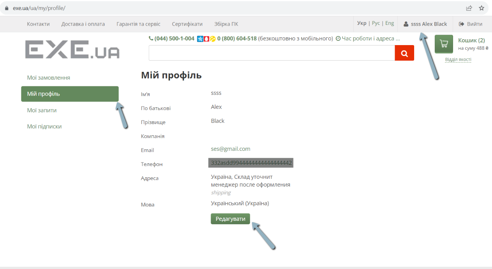

# Bug-report

ID:1  
Summary: On the "Мій профіль" page, you can make an invalid phone number in the editor 
 
Pre-conditions:
+ Open the website - https://exe.ua/ua/
+ The user must be logged in

Steps: 
     
> 1) Tap the button with the username    
> 2) Tap the "Мій профіль" button    
> 3) Click the Edit button  
> 4) Enter any characters and any length in the phone field  
> 5) Click on the save button  

Expected result: should receive a message that the phone is invalid  

Post-condition: The website accepts a new invalid user phone number  

Environment:Version 117.0.5938.92 (Official build), (64 bit) all browsers

Severity: Major  
Priority: Medium  
Type of bug: Functional  

Atachment:

