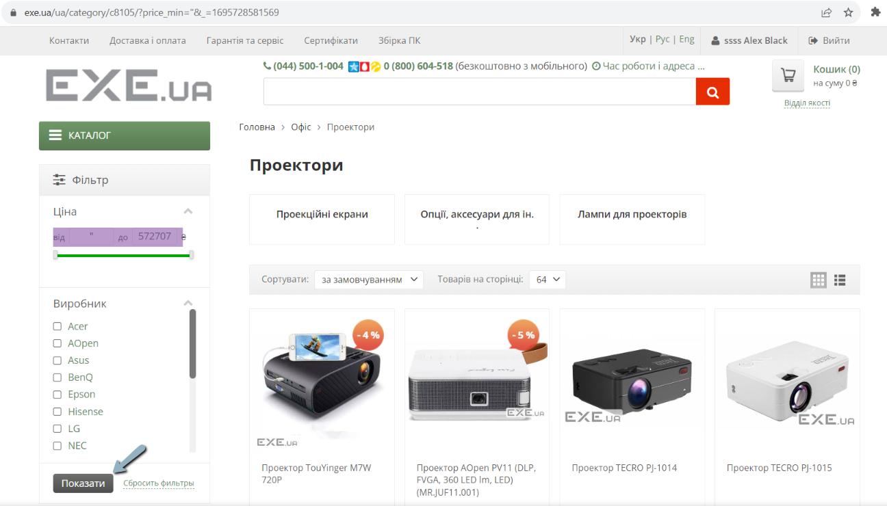
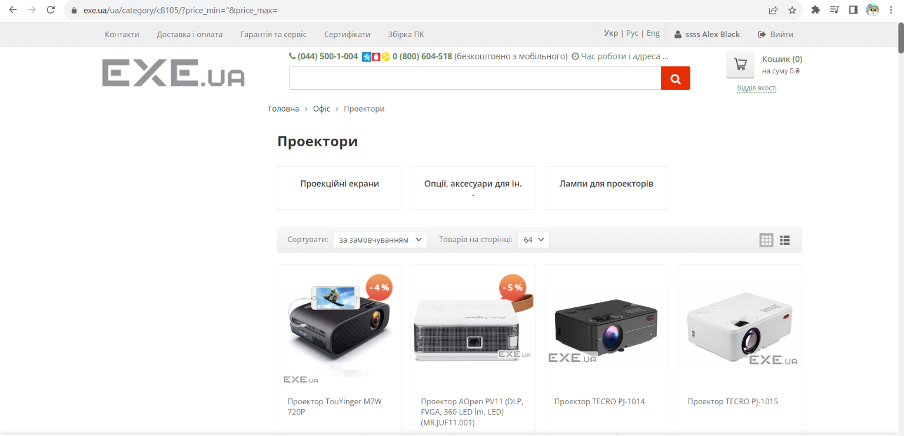
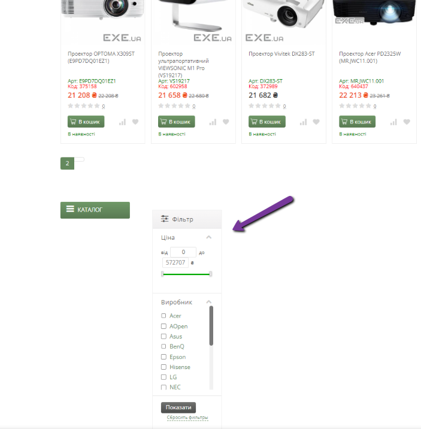

# Bug-report

ID:2  
Summary: Filter breaks when entering the character " in the minimum price field

Pre-conditions:
+ Open the website - https://exe.ua/ua/

Steps: 
     
> 1) Tap on the catalog  
> 2) Select the category Офіс -> проектори           
> 3) In the minimum price field, enter the symbol "  
> 4) In the maximum price field, do not enter anything  
> 5) Press Enter  

Expected result: The filter should change the " character to 0 or not allow the following characters 
 
Post-condition: Filtering is moved almost to the very bottom of the site page

Environment:Version 117.0.5938.92 (Official build), (64 bit) all browsers

Severity: low  
Priority: low  
Type of bug: Functional  

Atachment:

