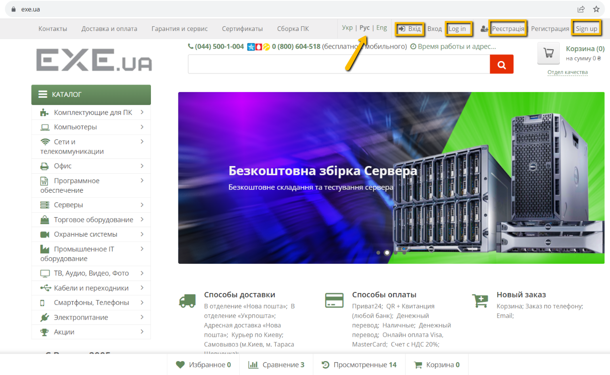

# Bug-report

ID:3  
Summary: Login and registration headers do not correspond to the russian interface language

Pre-conditions:
+ Open the website - https://exe.ua/ua/
+ The user must not be logged in

Steps: 
     
> 1) Select the russian language at the top

Expected result: After selecting a language, the "Login" and "Register" buttons are not translated into other languages

Post-condition: Additional text appears, which is also poorly adapted to mobile devices

Environment:Version 117.0.5938.92 (Official build), (64 bit) all browsers

Severity: loww 
Priority: low  
Type of bug: Usability 

Atachment:

