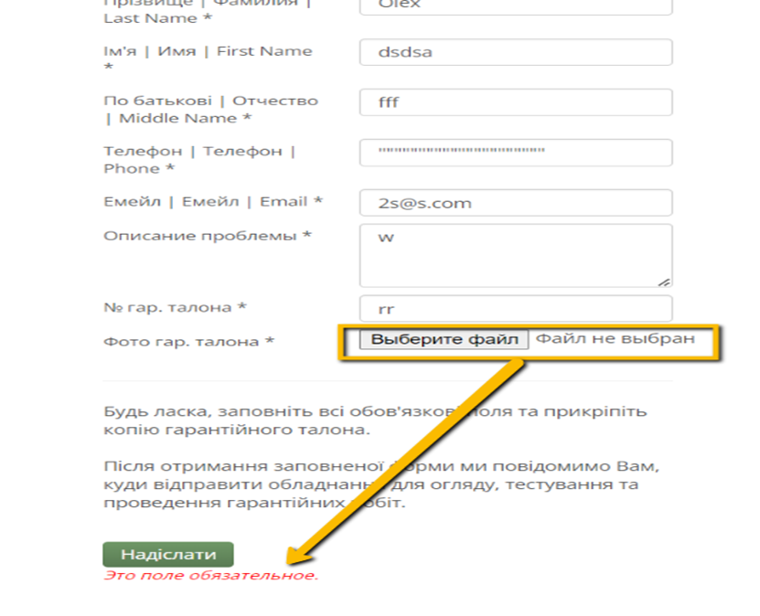
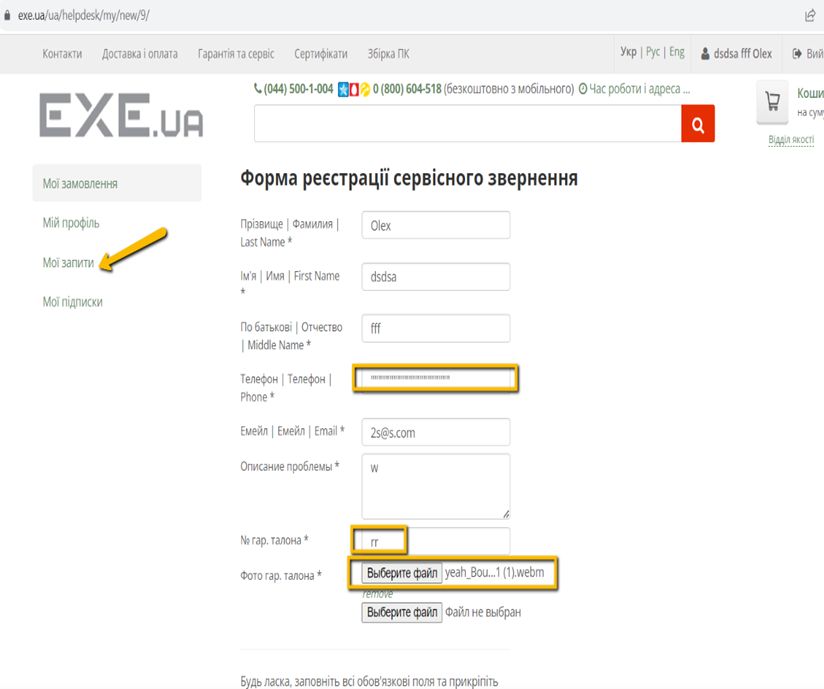

# Bug-report

ID:4  
Summary: The phone number, warranty card number and photo of the warranty card in the service request registration form are not validated 

Pre-conditions:
+ Open the website - https://exe.ua/ua/
+ The user must be logged in

Steps: 
     
> 1)Tap the button with the username    
> 2)Click on the "Мої запити" button   
> 3)Click on the button "Форма реєстрації сервісного звернення"  
> 4)Enter the last name field - Olex  
> 5)Enter the first name field - dsdsa   
> 6)Enter the middle name field - fff   
> 7)Entering an invalid phone number - """""""""""""""""  
> 8)Enter a valid email - 2s@s.com   
> 9)Enter a description of the problems   
> 10)Entering an invalid warranty card number  
> 11)Insert the video into the photo field of the warranty card (Note: if there is no attached file, an error message will appear in the send field, not near the place with the attachment)   
> 12)Click on the "надіслати" button

Expected result: After entering invalid data, an error message should appear and where the data is placed

Post-condition: The website accepts an invalid form for a service request  

Environment:Version 117.0.5938.92 (Official build), (64 bit) all browsers

Severity: low  
Priority: low  
Type of bug: Functional  

Atachment:

**No indication of where the error is located**

**Invalid data that the website accepts**

