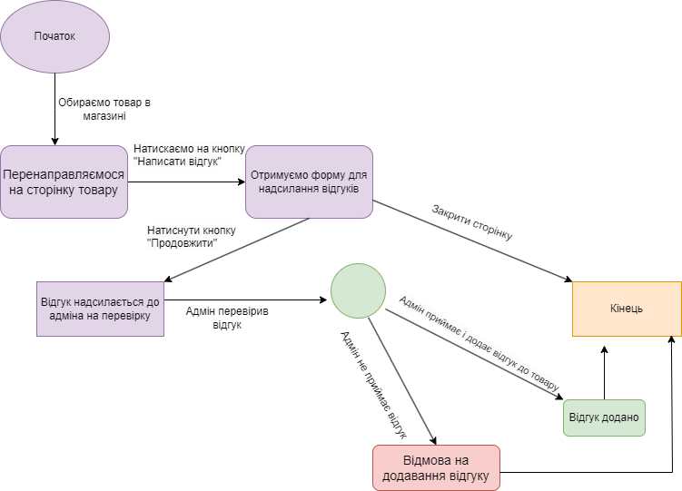

# Test Design Techniques - Decision Table, State Transition Diagram, Use Case Diagram

**Decision Table**  
Product delivery

**State Transition Diagram**  
Feedback diagram for a product

**Use Case Diagram**  
capabilities that a normal user and an admin have
